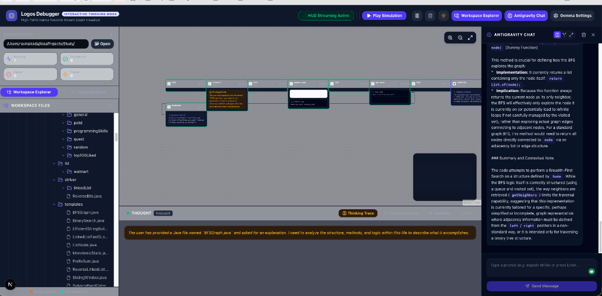

# 🧠 Logos Debugger — Interactive Thinking Mode HUD Dashboard



**Logos Debugger** is a premium, high-performance visual dashboard and local agentic developer harness designed to debug, trace, and inspect codebases using the official **Google Antigravity SDK** and local **Gemma / Gemini** models. 

Unlike traditional flat text command-line debuggers, Logos bridges stateful AI reasoning loops with a **reactive 2D node canvas**, a **chronological temporal timeline**, and a **collapsible multi-track chat interface** with **Human-in-the-Loop** execution steering.

---

## 🪐 How Logos Works (Project Overview)

Logos is designed as a **dual-layer agentic framework** that decouples filesystem operations and codebase search from the developer interface:

1. **The AI Agent Sidecar (`logos_agent.py`)**: A stateful local background process that integrates the `google-antigravity` SDK. It has direct read/write tool access bound to your target workspace (e.g., a directory of competitive programming problems like `CodeWars`).
2. **The API & Stream Gateway (Next.js server-side)**: Aggregates real-time event packets published by the Python agent via an RxJS event bus and proxies them to the browser using a high-fidelity Server-Sent Events (SSE) telemetry connection.
3. **The Visual HUD Dashboard (Next.js Frontend)**: The React-based developer dashboard that maps out execution graphs, tracks console logs, watches bound state variable mutations, and handles interactive prompt engineering.

---

## 🛠️ Main Project Components

### 1. Collapsible Multi-Track Chat Panel
The **Antigravity Chat Panel** features a real-time markdown and XML parser that intercepts structured AI outputs:
* **🧠 Thinking Tracks (`<thought>`)**: Collapses verbose LLM cognitive processes into premium expandable "🧠 Thinking Track" panels, keeping the main chat clean.
* **⚙️ Tool Execution Parameters (`<call>`)**: Renders details of the tools the agent is calling (such as directory scans or file view requests) as structured, elegant code cards.
* **⚡ Dynamic Layout Switcher**:
  * `Standard View`: Compact side-panel layout (`w-80 md:w-96`) for casual prompt steering.
  * `Split 50/50 View`: Occupies exactly half the workspace screen for simultaneous visualizer monitoring.
  * `Maximized View`: Expands to `80vw - 85vw` for high-density codebase reading and wide terminal logs review.

### 2. Interactive 2D Execution Canvas
Powered by `@xyflow/react`, this component renders the agent's logic flow dynamically as an interactive visual node graph:
* Nodes dynamically adjust their borders, shadows, and indicator animations based on telemetry states: `thinking` (glowing indigo pulse), `running` (indigo wave), `completed` (green check), and `failed` (pulsing red alert).
* Displays bound variables and stdout console logs directly inside the node cards.

### 3. State Variable Mutation Tracker
Located at the bottom panel of the HUD, this watches and logs state changes in real time. Whenever the agent mutates a variable or evaluates array sequences, it records the exact value transition (e.g., `user.tier: "guest" ➔ "pro"`), helping developers debug data flows.

### 4. Codebase File Tree Explorer
A reactive workspace scanner that recursively indexes directory files while ignoring bloated folders (like `node_modules`, `.next`, and `.git`).
* 🟠 **Glowing Orange Dots** represent files **read** by the agent.
* 🟢 **Glowing Teal Dots** represent files **written/modified** by the agent.

---

## 📖 Walkthrough Example: Debugging `AreSame.java`

To understand the power of Logos Debugger, let's look at how it visualizes and debugs the **`AreSame.java`** CodeWars square verification problem (located under `CodeWars/src/main/java/AreSame.java`).

### The Challenge
The function `comp(int[] a, int[] b)` must check if array `b` contains the squares of elements in array `a`, regardless of ordering and considering multiplicities. 

### The Debugging Flow in Logos
1. **Connect Workspace**: Enter `/Volumes/Study/git/CodeWars` as the Workspace Path in the Logos HUD header.
2. **Consult Logos**: In the Antigravity Chat Panel, type:
   > "Inspect the Streams solution in `@AreSame.java` and compare it to the commented out `Better Solution`."
3. **Telemetry Streaming**:
   * The Python Agent starts up and fires a `file-accessed` event for `AreSame.java`.
   * The **Workspace Explorer** instantly lights up `AreSame.java` with a **glowing orange circle** representing a read operation.
   * The **Topological Canvas** renders a new node representation: `Step: View Code`.
4. **Cognitive Parsing**:
   * The agent reviews the Streams approach:
     ```java
     List<Integer> squaredList = IntStream.of(a).map(x -> x * x).boxed().sorted().collect(Collectors.toList());
     ```
   * It flags the commented-out `Better Solution` utilizing `Arrays.equals` on sorted streams as a higher-performance option with lower boxing overhead:
     ```java
     Arrays.equals(Arrays.stream(a).map(i -> i * i).sorted().toArray(), Arrays.stream(b).sorted().toArray());
     ```
5. **State Mutation Trace**:
   * As the agent runs unit tests on your machine to verify both implementations, it publishes variable mutations to the HUD.
   * The **Bound State Tracker** lists the transitions of mock test arrays:
     * `a` ➔ `[2, 3, 4]`
     * `b` ➔ `[4, 9, 16]`
     * `isSame` ➔ `true`
6. **Execution Consent**:
   * Before the agent edits the code to swap the implementations or runs `mvn test`, it suspends execution and fires a long-poll request to the Next.js API.
   * A premium **Glassmorphic Consent Modal** pops up on the HUD, asking you to approve the `edit_file` tool call. You can click **Approve** to execute, or **Steer** it to add bounds testing.

---

## 🚀 Quick Start & Setup

### 1. Prerequisites
Ensure you have Python and Node installed:
```bash
python3 --version
node --version
```

Verify your python SDK dependencies:
```bash
pip3 install google-antigravity httpx
```

### 2. Launch the HUD Server
Navigate to the web application directory and boot up the development server:
```bash
cd logos-debugger
npm install
npm run dev
```

### 3. Open your Web Console
Open your browser and navigate to:
```text
http://localhost:3000
```
